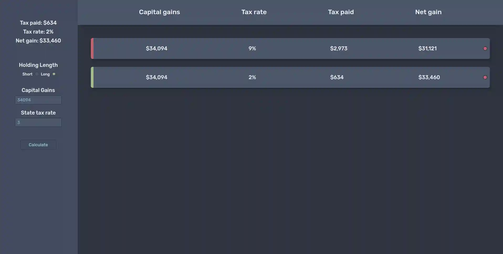

<h1 style="text-align: center;">Capital gains tax calculator</h1>
<em>Deprecated in favor of my new All in one 
 
<a href="https://github.com/MooseCapital/Charitable-Remainder-Trust">Charitable Trust Calculator</a></em>
 
  
  
 

 

>  Calculate short & long term capital gains, that takes your state tax rate into account.
> It uses the  [NordTheme](https://www.nordtheme.com/) color scheme.

 

👉 This is my first project fully on my own since learning React.
I am taking [Bob Ziroll's React Beginner course](https://scrimba.com/learn/learnreact). 

