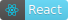

# Capital-gains-tax-calculator
 

This is my first project fully on my own since learning React.

I am taking Bob Ziroll's React Beginner course.This is my first course on React. I am 10 hours in the 11:55:00 course that is on [Youtube](https://youtu.be/bMknfKXIFA8) & [Scrimba](https://scrimba.com/learn/learnreact)

I thought I would create something I'm familiar with like my previous [Charitable-Remainder-Trust-Calculator](https://github.com/MooseCapital/-Charitable-Remainder-Trust-Calculator-) that is built in plain javascript only.

## Features
- calculate tax on every input
- input custom state tax rate
- pick short or long capital gains
- Localstorage will store tax calculations

## Lessons Learned

In the course, we learned how to pick a specific square out of all squares, and switch its background color. To do this, we mapped over squares data and set an id for each square, then passed in a toggle function with that specific squares id.
```
toggle={() => toggle(square.id)}
```
when clicking a square, we run the toggle function and check each square against the current square clicked.
```
function toggle(id) {
        setSquares(prevSquares => {
            return prevSquares.map((square) => {
                return square.id === id ? {...square, on: !square.on} : square
            })
        })
    }
```
If id's match, we get all our squares back the same except the one we clicked, which now has its "on" property toggled true/false which sets its style background color.

When remembering this lesson, I had to use the same thing since I want to delete a taxDiv in the list of many taxDivs. Unlike the squares that simply changed a property with mapping and kept ALL the items. I had to learn to filter my array down and REDUCE the number of taxDivs if the id's match onClick

deleteTaxDiv(id) is my onClick equivalent of toggle() above.
```
function deleteTaxDiv(id) {
        setTaxDivs(prevDivs => {
            return prevDivs.filter(div => div.id !== id)
        })}
```
 I passed down the taxDiv unique id through the event listener function, you might notice it is props.deleteTaxDiv. This is because I had to pass it from App to grandchild component. In the learning example, it was simply from App to child component.
 
 Specifically, it goes App.jsx -> Content.jsx -> Tax-Calculation.jsx
 ```
<Content
    deleteTaxDiv={deleteTaxDiv}
></Content>
```
Content.jsx
 ```
 deleteTaxDiv={() => props.deleteTaxDiv(div.id)}
 ```
 

and Tax-Calculation has the div that holds the onClick event
```
onClick={props.deleteTaxDiv}
```
